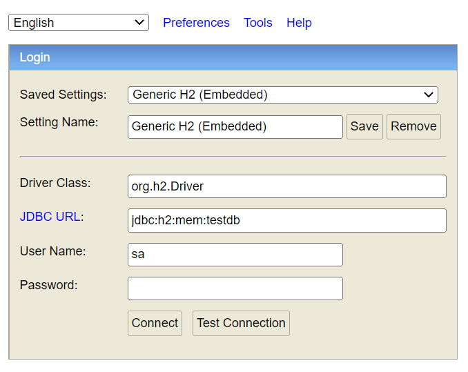

# 2022_kotlin_test_project

This is a single endpoint application, that accepts a record, and returns a count of the history of words that were submitted to the endpoint. 

The application will accept content in the [wordy](./schemas/wordy-reply.schema.json) format and reply with the running count in the [wordy-reply](./schemas/wordy-reply.schema.json) format. **NOTE**: application is NOT currently validating the submitted content against this schema. 

Instructions for posting to the endpoint can be found in the [Manual Testing](###Manual) section..

**Additional instructions** for running with docker can be found in [README_DOCKER.md](./README_DOCKER.md)

## Building the application

the application is written in java ~17~ 11 and utilizes the gradle build process. 

*System Requirements*

- OpenJDK 11 JDK 

To build the application visit the base path of the application and run the `./gradlew build` command

```batch
$ ./gradlew build

Welcome to Gradle 7.4.1!

Here are the highlights of this release:
 - Aggregated test and JaCoCo reports
 - Marking additional test source directories as tests in IntelliJ
 - Support for Adoptium JDKs in Java toolchains

For more details see https://docs.gradle.org/7.4.1/release-notes.html

Starting a Gradle Daemon, 1 incompatible Daemon could not be reused, use --status for details
<====---------> 37% EXECUTING [24s]

### 

BUILD SUCCESSFUL in 47s
8 actionable tasks: 8 executed
```

If built successfully a jar should have been placed into the `/build/libs` folder

## Running the application

The default setup for the application will utilize an in-memory database, but can also be pointed a relational database. 

_PLEASE COMPLETE BUILD STEP BEFORE CONTINUING_ 

Run the following command from the base path of the application

```batch
$ java -jar ./build/libs/kotlin_test_project-0.0.1-SNAPSHOT.jar
```

### H2 (default)

No changes need, If you are running the application locally, and want to also access the built in H2 console run the following command

```batch
$ SPRING_H2_CONSOLE_ENABLED=true java -jar ./build/libs/kotlin_test_project-0.0.1-SNAPSHOT.jar
```

You may then access the H2 console at `http://localhost:8080/h2-console`

you will need to enter `jdbc:h2:mem:testdb` in the JDBC URL: on the page, no password, click connect.



### Relational Database

#### DATABASE SETUP

You will need to create a new table in the relational database; I've include the [sql setup script](./SETUP/sql_setup_script.sql) in the `./SETUP` folder for the table creation.

#### APPLICATION SETUP

Create an `application-mysql.properties` in the root path of the application with the following information. 

Make sure to fill in your connection string, user name and password. I've included the base connection string for db4free.net for a free way to test this.

```properties
#application-mysql.properties
spring.datasource.url=<DB_CONNECTIONSTRING> 
# spring.datasource.url=jdbc:mysql://db4free.net:3306/<DBNAME>
spring.datasource.username=<DB_USERNAME>
spring.datasource.password=<DB_PASSWORD>
```

_Note_: I had only tested this on the Free My Sql database host; If you need to use a connection with a different driver, you will need to include that in the properties file also.

To run you will need to execute the following command.

```batch
$ SPRING_PROFILES_ACTIVE=mysql java -jar ./build/libs/kotlin_test_project-0.0.1-SNAPSHOT.jar
```

## DEVELOPMENT

For local development I would suggest creating the following files in your application base

- application-h2.properties
- application-mysql.properties
- application.properties

git and docker are setup to ignore all files in the base path matching `application*.properties` - so it should be safe to place any connections or settings needed, without worrying about inadvertently committing them.

You can then run test, or kick off the application with `./gradlew bootRun`

## Tests

### Manual

You can manual test the application endpoint using the content in the `./http` folder, these were written to use in the VSCode [humao.rest-client extention](https://marketplace.visualstudio.com/items?itemName=humao.rest-client) but should work with any applicationt hat accepts http language calls

You can also use curl calls like the following 

```batch
curl -X POST -H "Content-Type: application/json" \
     -d '{"id": 11, "message":"curl command was sent"}' \
     http://localhost:8080/api/wordy

# reply {"count": 4}
```

### Automaic

There are some automatic test that run on build, they can directly be called with `./gradlew test`

Automatic tests that are written

- [x] unit test
  - [x] controller
  - [x] utitlies
- [ ] e2e tests

## TODO Extras - if I have time

- [ ] is it a lot of work to allow No-SQL connections?
- [ ] Setup automated e2e tests
- [ ] base Error handler for the rest endpoints
- [ ] Add a landing page for stats (with endpoints)
- [ ] add swagger for manual tests
- [ ] e2e tests with docker and wrapper tsql database. 